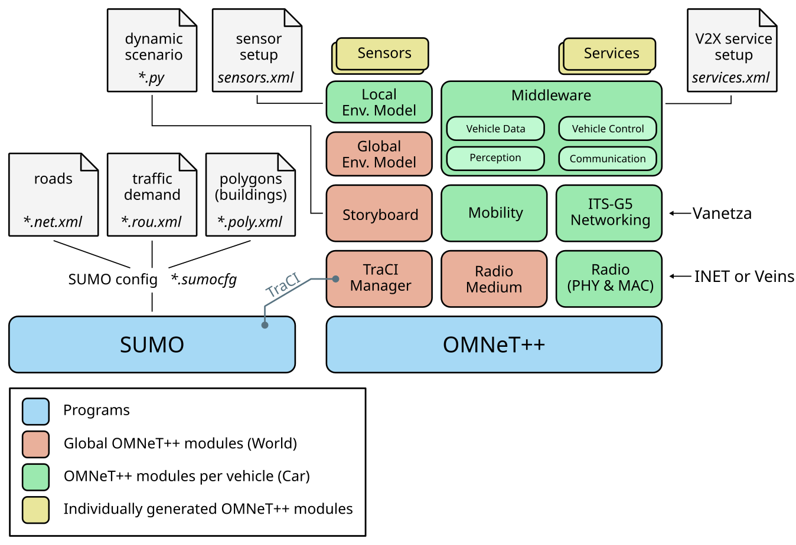

This page gives you a high-level overview of Artery.
One aspect concerns the major components and which dependency is realising them, respectively.
Another aspect is how files are organised in the Artery repository.

## Major components

Usually, two programs are working hand-in-hand when an Artery simulation is running.
On the left-hand side is the (vehicle) traffic simulator SUMO.
It is reading a configuration file at start, which refers to further XML files defining the road network, the traffic demand (where and how many vehicles are on their way etc.), and optionally miscellaneous polygons.
Those polygons may describe the outline of building or also vegetation.

On the right-hand is the OMNeT++ runtime environment, usually brought up by the *opp_run_release* or *opp_run_debug* executable.
Either of these executable is invoked when you invoke a target such `make run_example`.
TraCI manager is a global OMNeT++ module, which is responsible for launching the SUMO process and connecting to SUMO's traffic command interface (TraCI) via TCP.
Artery retrieves the position, speed, heading etc. of SUMO vehicles via this TraCI connection for each SUMO simulation step.
A submodule of the TraCI manager also takes care of creating, updating and deleting OMNeT++ modules representing those vehicles.

Note that Artery does not provide any simulation model of wireless communication itself, but employs existing models.
At present, you can choose between the IEEE 802.11 model of Veins and INET depending on your needs.
If you are not sure which one to pick, we mostly use the INET model nowadays for our simulations.

Artery wraps several entities of an ETSI ITS-G5 stack as OMNeT++ modules, e.g. the router, congestion control, and security entities.
Vanetza provides the implementation of these entities, however, Artery makes these accessible in OMNeT++.
Each vehicle possesses its own instance of the ITS-G5 stack then.

Central component of each vehicles in Artery is the *Middleware* module.
The middleware creates service modules according to an XML configuration file provided by the user.
It is possible to equip vehicles with different sets of applications by configuration, i.e. communication capabilities can vary among vehicles.

!!! danger
    In the figure showing Artery's high-level architecture, modules are not arranged in a way reflecting their position in a network stack or dependencies among them.
    For example, *Mobility* is not an upper layer of *Radio Medium*.

You can read more detailed introductions to Artery features at their respective pages:

- [Middleware](../features/middleware)
- [Storyboard](../features/storyboard)
- [Environment Model](../features/envmod)

## Repository layout

    | + ansible         Ansible playbooks and roles for deployment
    | + cmake           some additional CMake macros
    | + docs            documentation, including this website
    | - extern          third-party components
      | + inet          INET Framework
      | + vanetza       ITS-G5 network stack
      | ...
    | - scenarios
      | + artery        example scenario for demonstration
      | ...
    | - src
      | - artery
        | + application V2X application layer, facilities, services
        | + envmod      environment model with sensors
        | - inet        adaptation of INET Framework for V2X
          | + gemv2     GEMV² path loss model (requiring INET)
        | + networking  integration of Vanetza as OMNeT++ modules
        | + nic         generic code to adapt various radio models
        | + traci       integration of SUMO vehicles
        | ...
      | - traci         OMNeT++ endpoint for interaction with SUMO
        | + sumo        TraCI C++ client API from SUMO project

