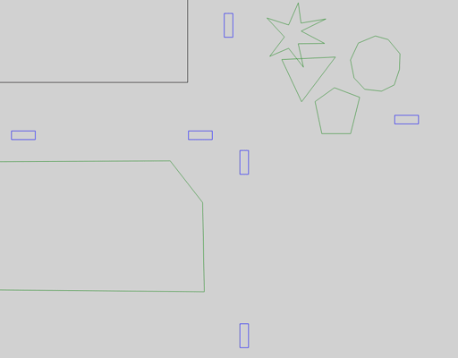

GEMV² is a **G**eometry-based **E**fficient propagation **M**odel for **V2V** communication.

## The original GEMV²

GEMV² has been developed by [Mate Boban](http://mateboban.net) while working on his PhD thesis.
There are three chief sources of information about this model:

- The [GEMV² website](http://vehicle2x.net):
  You can download the Matlab implementation and the user manual of GEMV² from there.
- Studying the code of this Matlab reference implementation
- An article explaining some concepts behind the model:
  > Mate Boban, Joao Barros, and Ozan K. Tonguz: "Geometry-Based Vehicle-to-Vehicle Channel Modeling for Large-Scale Simulation",
  > IEEE Transactions on Vehicular Technology, Volume 63, Number 9, November 2014 (DOI: [10.1109/TVT.2014.2317803](https://doi.org/10.1109/TVT.2014.2317803))

    A copy of this article is also available on the website.

## GEMV² in Artery

This C++ implementation of GEMV² has been written from scratch by Thiago C. Vieira (Universidade Federal do Parana - UFPR) and Raphael Riebl (Technische Hochschule Ingolstadt - THI).
However, Mate Boban's Matlab code and Artery's C++ version share some ideas, such as the usage of R-trees.
While the Matlab implementation computes received power for each communication pair per time step at once, we compute the signal attenuation per transmission by implementing INET's *IPathLoss* interface.
Hence, you can only use GEMV² with the INET radio model at the moment.

## Action!

The animations below show the bundled visualizer module, which draws the outlines of vehicles (blue), buildings (black) and foliage (green).
If GEMV² (`artery.inet.gemv2.LinkClassifier`) classifies a communication link to be mainly affected by buildings, it passes further path loss calculations on to its *NLOSb* model.
This model considers diffractions (orange) at the corners of buildings and onefold reflections (purple).

Foliage (single trees or forests) contributes attenuation based on total length a ray passes through it.
Our `artery.inet.gemv2.FoliageIndex` loads those polygons matching its *filterTypes* parameter from SUMO.
These polygons are treated as foliage by the *NLOSf* model then.
Artery's implementation supports concave, convex and overlapping foliage.

